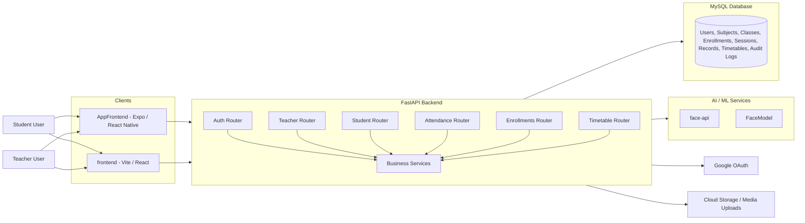
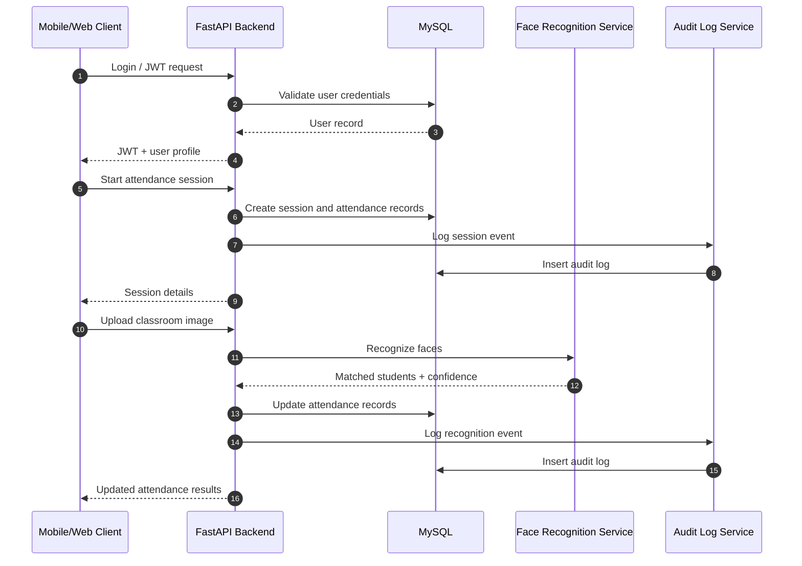
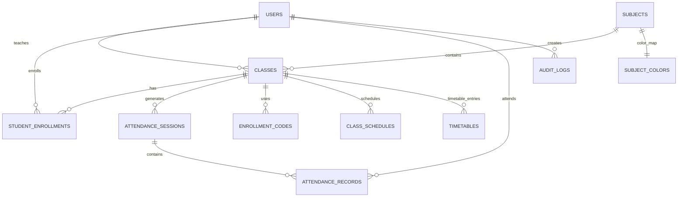

# Smart Attendance - Automated College Attendance Management System

## Developer Manual and Technical Documentation

**Repository scope:** `backend`, `AppFrontend`, `frontend`, and `FaceModel`

This document describes the current implementation of the project as found in the repository. It is written in an academic and industry-oriented style suitable for college submission, demo presentations, and portfolio use.

---

## Table of Contents

- [Project Title](#project-title)
- [Project Overview](#project-overview)
  - [Problem Statement](#problem-statement)
  - [Objective](#objective)
  - [Motivation](#motivation)
  - [Key Features](#key-features)
- [System Architecture](#system-architecture)
  - [High-Level Architecture](#high-level-architecture)
  - [Frontend Architecture](#frontend-architecture)
  - [Backend Architecture](#backend-architecture)
  - [Database Architecture](#database-architecture)
  - [AI/ML Architecture](#aiml-module-explanation)
  - [Data Flow Between Modules](#data-flow-between-modules)
- [Technology Stack](#technology-stack)
- [Project Folder Structure](#project-folder-structure)
- [Database Design](#database-design)
- [API Documentation](#api-documentation)
- [Authentication and Security](#authentication-and-security)
- [Core Modules Explanation](#core-modules-explanation)
- [AI/ML Module Explanation](#aiml-module-explanation)
- [Installation Guide](#installation-guide)
- [Deployment Guide](#deployment-guide)
- [Architecture Diagrams](#architecture-diagrams)
- [Challenges Faced](#challenges-faced)
- [Performance Optimizations](#performance-optimizations)

## 1. Project Title

**Smart Attendance - Automated College Attendance Management System**

The project provides a digital attendance platform for colleges that combines role-based access control, timetable management, student enrollment, attendance capture through code and QR flows, and AI-assisted face recognition for classroom attendance verification.

---

## 2. Project Overview

### Problem Statement

Manual attendance processes in colleges are time-consuming, repetitive, and vulnerable to human error, proxy attendance, and incomplete record keeping. Conventional paper registers also make it difficult to generate accurate attendance reports, identify low-attendance students early, and maintain audit trails for administrative review.

### Objective

The objective of this project is to develop a centralized attendance management system that:

- Reduces manual attendance effort for faculty.
- Provides secure authentication for students and teachers.
- Supports multiple attendance modes, including code, QR, and face recognition.
- Stores attendance records in a structured relational database.
- Generates real-time attendance summaries and reports.
- Improves transparency through audit logging and teacher override workflows.

### Motivation

The project is motivated by the need for a practical college-level attendance platform that is both technically robust and easy to use. It demonstrates a full-stack architecture involving mobile and web clients, API-driven backend logic, relational persistence, and AI-assisted automation.

### Key Features

- Student and teacher authentication using email/password and Google OAuth.
- JWT-based session authentication and role-based access control.
- Class, subject, and timetable management.
- Enrollment through codes and manual teacher enrollment.
- Attendance sessions with QR, code, and face-recognition support.
- Teacher approval and override of pending attendance records.
- Student attendance dashboards and per-subject statistics.
- Audit logging for key system actions.
- dynamic Time Table for professors and students 
- Mobile application support through Expo Router.
- Web application support through a Vite + React interface.

---

## 3. System Architecture

### High-Level Architecture

The system follows a layered client-server architecture:

- **Client layer:** Mobile app in `AppFrontend` and web app in `frontend`.
- **Application layer:** FastAPI backend in `backend`.
- **Data layer:** MySQL database managed through SQLAlchemy ORM.
- **AI/ML layer:** Face recognition pipeline exposed  trained/validated through `FaceModel`.
- **External services:** Google OAuth and optional cloud storage for uploaded attendance images.

### Frontend Architecture

The project contains two frontend implementations:

1. **AppFrontend**
   - Built with Expo, React Native, TypeScript, and Expo Router.
   - Used for mobile-first interaction.
   - Supports login, attendance flows, camera-based actions, and student/teacher dashboards.
   - Uses `expo.extra.apiUrl` to connect to the backend.

2. **frontend**
   - Built with Vite, React, TypeScript, Tailwind CSS, and shadcn-style components.
   - Suitable for a web dashboard or admin-style interface.
   - Uses SPA routing with Vercel rewrite support.

### Backend Architecture

The backend uses FastAPI with a modular router and service pattern:

- **Routers** define API endpoints for authentication, teacher operations, student operations, attendance, enrollments, and timetable management.
- **Services** contain business logic such as attendance state updates, face recognition integration, authorization helpers, audit logging, and storage helpers.
- **Utils** provide JWT helpers, role checks, Google token validation, and query helper functions.
- **Database session management** is handled through SQLAlchemy and a shared session dependency.

### Database Architecture

The database is relational and normalized around a core academic model:

- Users are linked to classes as teachers or students.
- Subjects are linked to classes.
- Students enroll in classes through a join table.
- Attendance sessions belong to classes.
- Attendance records belong to attendance sessions and students.
- Enrollment codes and class schedules support class-level administration.
- Timetable entries and subject colors enrich the student experience.
- Audit logs track sensitive operations.

### AI/ML Architecture

The AI/ML portion of the system supports face recognition for classroom attendance.

- `FaceModel` contains training, embedding generation, evaluation, and recognition scripts.

- The backend uploads classroom images, passes them to the recognition layer, receives matched identities and confidence scores, and updates attendance records.
- OpenCV, InsightFace, ONNX Runtime, NumPy, and scikit-learn are used in the AI pipeline.

### Data Flow Between Modules

1. The user signs in through the mobile or web client.
2. The client obtains a JWT token from the backend.
3. Authenticated requests are sent to the relevant API router.
4. The backend validates the token and role before processing the request.
5. Business logic updates the database through SQLAlchemy.
6. For face recognition flows, the backend delegates image analysis to the AI service.
7. Results are written back to attendance records and audit logs.
8. The frontend renders attendance summaries, timetables, and teacher approval states from the API response.

---

## 4. Technology Stack

| Layer | Technologies |
|---|---|
| Frontend technologies | React, React Native, Expo, Expo Router, TypeScript, Tailwind CSS, shadcn-style UI, React Query, React Hook Form |
| Backend technologies | FastAPI, Uvicorn, SQLAlchemy, Alembic, Pydantic v2, Python, JWT, bcrypt, Google Auth libraries |
| Database | MySQL with SQLAlchemy ORM |
| AI/ML libraries | InsightFace, ONNX Runtime, OpenCV, NumPy, scikit-learn, Torch, Pillow, pyzbar |
| APIs used | Google OAuth, backend REST APIs, QR code generation/verification, face recognition service API, optional cloud storage API |
| Tools and platforms | Expo, Vite, Vercel, Docker, Docker Compose, MySQL, Alembic, Render-style deployment, EAS configuration in Expo |

---

## 5. Project Folder Structure

| Path | Purpose |
|---|---|
| `backend/` | Main FastAPI backend responsible for authentication, attendance logic, enrollment, timetable, and database access. |
| `backend/main.py` | Backend entry point, middleware, CORS configuration, and router registration. |
| `backend/config.py` | Environment-driven configuration values for database, JWT, OAuth, CORS, face API, and storage. |
| `backend/models/` | SQLAlchemy ORM models for users, classes, attendance, schedules, and audit logs. |
| `backend/schemas/` | Pydantic request and response models for the API. |
| `backend/routes/` | API route handlers grouped by domain. |
| `backend/services/` | Business logic such as attendance decision rules, face recognition integration, storage, and auditing. |
| `backend/utils/` | JWT helpers, authorization helpers, Google token helpers, and utility functions. |
| `backend/db/` | Database session helpers and related persistence utilities. |
| `backend/migrations/` and `backend/alembic/` | Database migration scripts and Alembic configuration. |
| `AppFrontend/` | Expo mobile application for student and teacher interaction. |
| `AppFrontend/app/` | Expo Router screens and nested route groups. |
| `AppFrontend/src/` | Shared frontend components, services, config, and utilities. |
| `frontend/` | Vite-based web frontend for browser access and dashboard-style views. |
| `frontend/src/` | React components, pages, hooks, services, types, and contexts for the web UI. |
| `FaceModel/` | Face recognition training, evaluation, embeddings, and recognition experiments. |
| Root scripts such as `setup.sh`, `setup.bat`, `start-backend.sh`, `start-frontend.sh`, `run.sh` | Convenience scripts for local setup and execution. |
| `architecture_diagrams.md` | Existing architecture notes and diagrams for the system. |
| `DUAL_VERIFICATION_TEST_GUIDE.md` | Verification guide for combined face, QR, and code attendance workflows. |

### Component and Module Purpose

- `AppFrontend/app/(auth)` handles authentication screens and role selection.
- `AppFrontend/app/(app)` contains authenticated application screens.
- `backend/routes/attendance.py` coordinates attendance sessions, QR verification, code submission, face recognition, and approval flows.
- `backend/routes/teacher.py` handles teacher administration of subjects, classes, schedules, and session control.
- `backend/routes/student.py` exposes student enrollment and attendance reporting.
- `backend/routes/enrollments.py` supports enrollment codes and class schedule management.
- `backend/routes/timetable.py` manages timetable entries and subject colors.
- `FaceModel/` contains model-level experimentation, dataset directories, embeddings, and evaluation artifacts.
- `face-api/` acts as the service boundary for model inference.

---

## 6. Database Design

### Database Schema

The application uses a relational schema designed around academic administration and attendance tracking.

| Table | Purpose | Important Fields |
|---|---|---|
| `users` | Stores students and teachers in one table. | `id`, `name`, `email`, `roll_number`, `password_hash`, `role`, `provider`, `google_id`, `created_at`, `updated_at` |
| `subjects` | Stores courses or subject definitions. | `id`, `name`, `code` |
| `classes` | Stores subject sections taught by a teacher. | `id`, `subject_id`, `teacher_id`, `year`, `section` |
| `student_enrollments` | Join table linking students to classes. | `id`, `student_id`, `class_id`, `enrolled_at` |
| `attendance_sessions` | Represents one attendance event for a class. | `id`, `class_id`, `date`, `qr_enabled`, `qr_code`, `attendance_code`, `qr_expires_at`, `code_expires_at`, `face_recognition_enabled`, `status` |
| `attendance_records` | Stores raw attendance signals and final decision. | `id`, `session_id`, `student_id`, `face_detected`, `qr_verified`, `confidence`, `final_status`, `overridden_by_teacher`, `override_reason` |
| `enrollment_codes` | Stores codes used by students to join a class. | `id`, `class_id`, `code`, `created_by`, `is_active` |
| `class_schedules` | Stores weekly timetable-style schedules for a class. | `id`, `class_id`, `day_of_week`, `start_time`, `end_time`, `room_number` |
| `timetables` | Stores timetable entries used by student and professor views. | `id`, `class_id`, `day_of_week`, `start_time`, `end_time`, `room_number` |
| `subject_colors` | Assigns consistent visual colors to subjects. | `id`, `subject_id`, `color_code`, `text_color` |
| `audit_logs` | Captures important system actions for traceability. | `id`, `event_id`, `event_type`, `entity_type`, `entity_id`, `user_id`, `event_metadata`, `timestamp` |

### Relationships

- One teacher can teach many classes.
- One subject can map to many classes.
- One student can enroll in many classes.
- One class can have many students through `student_enrollments`.
- One class can have many attendance sessions.
- One attendance session can have many attendance records.
- One class can have many schedules and timetable entries.
- One subject can have one color mapping.
- One user can create many enrollment codes and many audit log events.

### ER Diagram Explanation

The ER model centers on `users`, `subjects`, and `classes` as the master academic entities. Attendance is modeled as a session-record pair so that each lecture generates a separate attendance session with per-student records. This structure makes it possible to support multiple attendance strategies while preserving a clean historical log.

### Important Fields and Their Purpose

- `users.role`: Determines whether the account is a student or teacher.
- `users.provider`: Distinguishes local login from Google OAuth accounts.
- `attendance_sessions.status`: Controls whether a session is open or closed.
- `attendance_sessions.qr_code` and `attendance_sessions.attendance_code`: Session-specific verification values.
- `attendance_records.final_status`: Stores the final computed or overridden attendance state.
- `attendance_records.overridden_by_teacher`: Indicates manual intervention by a teacher.
- `enrollment_codes.is_active`: Allows a teacher to invalidate a code without deleting history.
- `audit_logs.event_type`: Supports operational traceability and debugging.

---

## 7. API Documentation

### API Conventions

- Most protected endpoints expect `Authorization: Bearer <JWT>`.
- `teacher` and `student` are the backend role values. Some UI flows use the label `professor`, but the backend role remains `teacher`.
- Public endpoints do not require authentication.
- Several endpoints return plain JSON dictionaries rather than dedicated response schemas. Those responses are documented with representative payloads.

### System Endpoints

| Endpoint | Method | Auth | Purpose | Request | Response |
|---|---|---|---|---|---|
| `/` | GET | Public | Returns API status. | None | `{"message":"College Attendance Management System API","status":"running","version":"1.0.0"}` |
| `/health` | GET | Public | Returns health and database availability. | None | `{"status":"healthy","timestamp":"...","environment":"development","db_available":true}` |

### Authentication APIs

| Endpoint | Method | Auth | Purpose | Request | Response |
|---|---|---|---|---|---|
| `/auth/register` | POST | Public | Registers a student or teacher and returns a JWT. | `{"name":"Asha","email":"asha@example.com","password":"StrongPass123","role":"student"}` | `201 TokenResponse: {"access_token":"...","token_type":"bearer","user":{...},"role_warning":null}` |
| `/auth/login` | POST | Public | Logs in using email or roll number plus password. | `{"identifier":"asha@example.com","password":"StrongPass123"}` | `{"access_token":"..."}` |
| `/auth/google` | POST | Public | Google OAuth login with domain validation. | `{"id_token":"<google-id-token>","role":"teacher"}` | `TokenResponse with user profile and optional role_warning` |
| `/auth/me` | GET | JWT | Returns the current authenticated user. | None | `CurrentUserResponse: {"id":1,"name":"Asha","email":"asha@example.com","role":"student"}` |
| `/auth/mobile/google` | POST | Public | Mobile Google login for the Expo app. | `{"id_token":"<google-id-token>"}` | `{"access_token":"...","user":{"name":"...","email":"...","picture":"..."}}` |

### Teacher APIs: Subject Management

| Endpoint | Method | Auth | Purpose | Request | Response |
|---|---|---|---|---|---|
| `/teachers/subjects` | POST | Teacher | Creates a new subject. | `{"name":"Data Structures","code":"CS201"}` | `201 SubjectResponse` |
| `/teachers/subjects` | GET | Teacher | Lists all subjects. | None | `[{"id":1,"name":"Data Structures","code":"CS201"}]` |
| `/teachers/subjects/{subject_id}` | GET | Teacher | Returns a subject by ID. | Path parameter only | `{"id":1,"name":"Data Structures","code":"CS201"}` |
| `/teachers/subjects/{subject_id}` | PATCH | Teacher | Updates name or code. | `{"name":"Advanced Data Structures"}` | Updated subject object |
| `/teachers/subjects/{subject_id}` | DELETE | Teacher | Deletes a subject and cascades related classes. | None | `{"success":true}` |

### Teacher APIs: Class Management

| Endpoint | Method | Auth | Purpose | Request | Response |
|---|---|---|---|---|---|
| `/teachers/classes` | POST | Teacher | Creates a class section. | `{"subject_id":1,"teacher_id":5,"year":3,"section":"A"}` | `201 ClassResponse` |
| `/teachers/classes` | GET | Teacher | Lists classes taught by the current teacher. | None | `[{"id":10,"subject_name":"Data Structures","section":"A"}]` |
| `/teachers/classes/{class_id}` | GET | Teacher | Returns one class taught by the current teacher. | Path parameter only | `ClassResponse` |
| `/teachers/classes/{class_id}/students` | GET | Teacher | Lists enrolled students in a class. | None | `[{"student_id":2,"student_name":"Asha","email":"..."}]` |
| `/teachers/classes/students/batch` | POST | Teacher | Fetches students for multiple classes in one call. | `{"class_ids":[1,2,3]}` | `{ "1": [...], "2": [...], "3": [...] }` |
| `/teachers/classes/{class_id}/students/{student_id}` | DELETE | Teacher | Removes a student from a class. | None | `{"success":true,"message":"Student ... has been removed"}` |
| `/teachers/classes/{class_id}/students` | POST | Teacher | Adds a student to a class manually. | `{"student_id":2}` | `{"success":true,"message":"Student ... has been enrolled"}` |
| `/teachers/classes/{class_id}` | DELETE | Teacher | Deletes a class. | None | `{"success":true}` |

### Teacher APIs: Attendance Session Control

| Endpoint | Method | Auth | Purpose | Request | Response |
|---|---|---|---|---|---|
| `/teachers/attendance/session/start` | POST | Teacher | Starts a new session with optional QR. | `{"class_id":10,"qr_enabled":true}` | `201 AttendanceSessionResponse` |
| `/teachers/attendance/session/{session_id}` | GET | Teacher | Returns session details. | Path parameter only | `AttendanceSessionResponse` |
| `/teachers/classes/{class_id}/sessions` | GET | Teacher | Lists sessions for a class. | None | `[AttendanceSessionResponse, ...]` |
| `/teachers/attendance/session/{session_id}/records` | GET | Teacher | Returns all attendance records for a session. | None | `[{"id":1,"student_name":"Asha","final_status":"present"}]` |
| `/teachers/attendance/session/{session_id}/override` | PATCH | Teacher | Overrides a student attendance record. | `{"student_id":2,"final_status":"present","reason":"Medical leave"}` | `AttendanceRecordResponse` |
| `/teachers/attendance/session/{session_id}/finalize` | POST | Teacher | Closes a session. | None | `{"success":true,"message":"Session finalized"}` |

### Teacher APIs: Class Schedules

| Endpoint | Method | Auth | Purpose | Request | Response |
|---|---|---|---|---|---|
| `/teachers/classes/{class_id}/schedules` | GET | Teacher | Lists schedules for a class. | None | `[{"day_of_week":1,"start_time":"10:00:00"...}]` |
| `/teachers/classes/{class_id}/schedules` | POST | Teacher | Adds a schedule entry. | `{"day_of_week":1,"start_time":"10:00","end_time":"11:00","room_number":"A101"}` | `{"success":true,"schedule_id":7}` |
| `/teachers/classes/{class_id}/schedules/{schedule_id}` | DELETE | Teacher | Deletes a schedule entry. | None | `{"success":true,"schedule_id":7}` |

### Student APIs

| Endpoint | Method | Auth | Purpose | Request | Response |
|---|---|---|---|---|---|
| `/students/enroll` | POST | Student | Enrolls current student in a class. | `{"class_id":10}` | `201 StudentEnrollmentResponse` |
| `/students/enrollments` | GET | Student | Lists current student enrollments. | None | `[StudentEnrollmentResponse, ...]` |
| `/students/enroll/{class_id}` | DELETE | Student | Removes the student from a class. | None | `{"success":true}` |
| `/students/attendance` | GET | Student | Returns attendance report by subject/class. | None | `{"student_id":2,"attendance_by_subject":[...],"overall_percentage":84.5}` |

### Enrollment and Schedule APIs

| Endpoint | Method | Auth | Purpose | Request | Response |
|---|---|---|---|---|---|
| `/enrollments/codes` | POST | Teacher | Creates an enrollment code for a class. | `{"class_id":10,"code":"ABC123"}` | `EnrollmentCodeResponse` |
| `/enrollments/codes/class/{class_id}` | GET | Teacher | Lists codes for a class. | None | `[EnrollmentCodeResponse, ...]` |
| `/enrollments/codes/batch` | POST | Teacher | Gets codes for multiple classes. | `{"class_ids":[1,2,3]}` | `{ "1": [...], "2": [...] }` |
| `/enrollments/codes/{code_id}` | DELETE | Teacher | Deactivates a code. | None | `204 No Content` |
| `/enrollments/schedules` | POST | Teacher | Creates a schedule entry with query `class_id`. | `class_id=10` and body `{"day_of_week":1,"start_time":"10:00","end_time":"11:00","room_number":"A101"}` | `ClassScheduleResponse` |
| `/enrollments/schedules/class/{class_id}` | GET | Public | Returns class schedules. | None | `[ClassScheduleResponse, ...]` |
| `/enrollments/schedules/batch` | POST | Public | Gets schedules for multiple classes. | `{"class_ids":[1,2,3]}` | `{ "1": [...], "2": [...] }` |
| `/enrollments/schedules/{schedule_id}` | PUT | Teacher | Updates a schedule entry. | `{"day_of_week":2,"start_time":"14:00","end_time":"15:00","room_number":"B202"}` | `ClassScheduleResponse` |
| `/enrollments/schedules/{schedule_id}` | DELETE | Teacher | Deletes a schedule entry. | None | `204 No Content` |
| `/enrollments/enroll` | POST | Student | Enrolls using an enrollment code. | `{"code":"ABC123"}` | `{"message":"Successfully enrolled in the class","class_id":10}` |
| `/enrollments/my-classes` | GET | Student | Returns enrolled classes with schedules. | None | `[EnrolledClassResponse, ...]` |

### Timetable APIs

| Endpoint | Method | Auth | Purpose | Request | Response |
|---|---|---|---|---|---|
| `/timetable/add` | POST | Teacher | Adds timetable entry for a class. | `{"class_id":10,"day_of_week":1,"start_time":"10:00:00","end_time":"11:00:00","room_number":"A101"}` | `TimetableResponse` |
| `/timetable/{timetable_id}` | PUT | Teacher | Updates timetable entry. | `{"start_time":"10:30:00","end_time":"11:30:00","room_number":"A102"}` | `TimetableResponse` |
| `/timetable/{timetable_id}` | DELETE | Teacher | Deletes timetable entry. | None | `{"message":"Timetable entry deleted successfully"}` |
| `/timetable/colors/assign` | POST | Authenticated user | Assigns a unique subject color. | `{"subject_id":1,"color_code":"#4ECDC4","text_color":"#FFFFFF"}` | `SubjectColorResponse` |
| `/timetable/colors/{subject_id}` | GET | Public | Returns the color for a subject. | None | `SubjectColorResponse` |
| `/timetable/class/{class_id}` | GET | Authenticated user | Returns timetable entries for a class. | None | `[TimetableWithClassInfo, ...]` |
| `/timetable/student/my-timetable` | GET | Authenticated user | Returns timetable for the logged-in student. | None | `[TimetableWithClassInfo, ...]` |

### Attendance APIs

| Endpoint | Method | Auth | Purpose | Request | Response |
|---|---|---|---|---|---|
| `/attendance/class/{class_id}/active-session` | GET | Teacher | Returns the active session for a class. | None | `{"has_active_session":true,"session":{...}}` |
| `/attendance/classes/active-sessions/batch` | POST | Teacher | Returns active sessions for multiple classes. | `{"class_ids":[1,2,3]}` | `{ "1": {"has_active_session":true}, "2": {"has_active_session":false} }` |
| `/attendance/session/{session_id}/upload-image` | POST | Teacher | Uploads a classroom image for face recognition. | `multipart/form-data` with `image` | `ImageUploadResponse` |
| `/attendance/session/{session_id}/verify` | POST | Student | Verifies attendance by QR code. | `{"qr_code":"ATTEND_...","student_id":2}` | `QRVerificationResponse` |
| `/attendance/record/{record_id}` | GET | Authenticated user | Returns a single attendance record with permission checks. | None | `AttendanceRecordResponse` |
| `/attendance/session/{session_id}/records` | GET | Authenticated user | Returns records for a session. | None | `AttendanceRecordResponse[]` |
| `/attendance/session/create-with-code` | POST | Teacher | Creates or reuses an attendance session with a 6-digit code. | Query params `class_id`, `face_recognition_enabled`, `generate_code` | `AttendanceSessionResponse` |
| `/attendance/submit-code` | POST | Student | Submits a code to mark attendance. | `{"code":"123456"}` | `AttendanceCodeResponse` |
| `/attendance/session/generate-qr-code` | POST | Teacher | Generates a QR code for attendance. | Query params `class_id`, `face_recognition_enabled` | `QRCodeGenerateResponse` |
| `/attendance/submit-qr-code` | POST | Student | Submits scanned QR code data. | `{"qr_code_data":"ATTEND_..."}` | `QRCodeUploadResponse` |
| `/attendance/upload-qr-image` | POST | Student | Uploads an image containing a QR code. | `multipart/form-data` with `image` | `QRCodeUploadResponse` |
| `/attendance/my-attendance` | GET | Student | Returns attendance summary across enrolled classes. | None | `[{"class_id":10,"attendance_percentage":84.5,"recent_records":[...]}]` |
| `/attendance/session/{session_id}/disconnect` | POST | Teacher | Manually closes a session early. | None | `AttendanceSessionResponse` |
| `/attendance/session/{session_id}` | DELETE | Teacher | Deletes a session. | None | `{"success":true,"session_id":5}` |
| `/attendance/student/{student_id}/class/{class_id}` | GET | Teacher | Returns attendance percentage for a student in a class. | None | `{"student_id":2,"class_id":10,"attendance_percentage":84.5}` |
| `/attendance/pending/code-submissions` | GET | Teacher | Returns pending approvals for manual review. | None | `PendingAttendanceResponse[]` |
| `/attendance/approve-attendance` | POST | Teacher | Approves or rejects a pending submission. | `{"record_id":5,"action":"approve","reason":"Valid evidence"}` | `{"success":true,"message":"Attendance approved successfully"}` |
| `/attendance/code-submissions/{record_id}/approve` | POST | Teacher | Compatibility endpoint to approve a pending record. | None | `{"success":true,"final_status":"present"}` |
| `/attendance/code-submissions/{record_id}/reject` | POST | Teacher | Compatibility endpoint to reject a pending record. | None | `{"success":true,"final_status":"absent"}` |

### Authentication and Security Notes

- All protected endpoints use JWT bearer authentication through dependency injection.
- Teacher-only endpoints are guarded by role checks.
- Student-only endpoints are guarded by role checks.
- Google OAuth login validates token integrity and accepted client IDs/domains.
- Passwords are never stored in plain text; they are hashed before persistence.
- Attendance session data is time-limited and auto-closed when expired.
- Audit logs are written for important security-sensitive operations.

---

## 8. Authentication and Security

### Login System

The system supports two login paths:

- **Local authentication:** Email or roll number with password.
- **Google OAuth authentication:** Google ID token based sign-in for web and mobile flows.

### JWT / Session Authentication

- After successful login, the backend issues a JWT access token.
- The frontend stores the token and sends it on protected requests in the `Authorization` header.
- Tokens are validated on every protected request.
- The mobile app also uses a session timeout configured from Expo settings.

### Password Encryption

- Passwords are hashed before storage.
- The project uses secure password hashing libraries from the Python security stack.
- The database stores only the hash, not the raw password.

### Role-Based Access

- The backend distinguishes between `student` and `teacher` roles.
- Teacher-specific endpoints are restricted to faculty accounts.
- Student-specific endpoints are restricted to student accounts.
- Some shared endpoints accept both roles but apply data-level permission checks.

### Security Measures Implemented

- JWT bearer authentication.
- Role-based dependencies for teacher and student access.
- Google token validation.
- Domain-aware OAuth restrictions for institutional accounts.
- CORS policy configured from environment variables.
- ORM-based database access to reduce injection risk.
- Session expiry for QR and code-based attendance.
- Audit logging for traceability.
- Permission checks on class ownership before modifying records.

---

## 9. Core Modules Explanation

### 9.1 Authentication Module

**Purpose:**
Handles registration, login, Google OAuth, and current-user resolution.

**Workflow:**
1. The user submits credentials or Google token.
2. The backend validates the request.
3. A JWT token is issued if the authentication succeeds.
4. The client stores the token and reuses it for protected routes.

**Internal Logic:**
- Local login supports email or roll number identifiers.
- Google login creates or updates the user profile when needed.
- Domain validation prevents unauthorized external accounts.

**Technologies Used:**
FastAPI, JWT, bcrypt, Google Auth, Pydantic.

**Integration:**
Used by every other module because all protected operations depend on the current user identity.

### 9.2 Subject and Class Management Module

**Purpose:**
Creates and maintains subjects and class sections.

**Workflow:**
- Teachers create subjects.
- Teachers create classes tied to subjects.
- Classes are linked to a teacher, year, and section.
- Students later enroll in those classes.

**Internal Logic:**
- Unique subject codes are enforced.
- Ownership checks ensure that teachers only modify their own classes.
- Related schedules and codes are created around class records.

**Technologies Used:**
SQLAlchemy, FastAPI routes, Pydantic request schemas.

**Integration:**
Forms the foundation for enrollment, timetable, and attendance session modules.

### 9.3 Enrollment Module

**Purpose:**
Allows students to join classes through codes and supports teacher-side enrollment control.

**Workflow:**
- A teacher creates an enrollment code.
- A student submits the code to join the class.
- Teachers can also add or remove students manually.

**Internal Logic:**
- Codes are validated against active status.
- Duplicate enrollments are blocked.
- Batch endpoints reduce repeated API calls.

**Technologies Used:**
FastAPI, SQLAlchemy, unique code generation, audit logging.

**Integration:**
Feeds the attendance session population logic and student timetable views.

### 9.4 Attendance Session Module

**Purpose:**
Manages lecture-specific attendance windows.

**Workflow:**
- A teacher starts a session for a class.
- The backend creates attendance records for enrolled students.
- The session can accept code, QR, or face-based submissions.
- Teachers finalize the session when collection is complete.

**Internal Logic:**
- Only one active session per class is allowed at a time.
- Sessions auto-expire after a time window.
- Attendance records are computed using raw verification signals.
- Manual teacher override is allowed.

**Technologies Used:**
FastAPI, SQLAlchemy, JWT, audit logging.

**Integration:**
Connects directly to QR, code, face recognition, and approval workflows.

### 9.5 QR and Code Attendance Module

**Purpose:**
Supports low-friction attendance capture through a numeric code or QR token.

**Workflow:**
- The teacher generates a code or QR session.
- The student scans or submits the value.
- The backend checks expiry, enrollment, and session state.
- The record is updated and may remain pending approval depending on dual-verification rules.

**Internal Logic:**
- Codes and QR values are session-specific.
- Expiration is enforced at the backend.
- In dual-verification mode, partial submissions can trigger `pending_approval`.

**Technologies Used:**
qrcode, pyzbar, Pillow, FastAPI file upload handling.

**Integration:**
Shares the attendance record update logic with face recognition and teacher approval flows.

### 9.6 Face Recognition Module

**Purpose:**
Automates classroom attendance based on uploaded images.

**Workflow:**
- A teacher uploads a classroom image.
- The backend forwards the image to the recognition layer.
- Recognized faces are mapped to enrolled students.
- The corresponding attendance records are updated.

**Internal Logic:**
- Confidence scores are captured for recognition matches.
- Recognition failures do not block image persistence.
- The system stores original and annotated images for review.

**Technologies Used:**
InsightFace, ONNX Runtime, OpenCV, NumPy, scikit-learn, Torch, Pillow.

**Integration:**
Works with the attendance session module and the storage service.

### 9.7 Timetable and Schedule Module

**Purpose:**
Provides weekly class visibility for teachers and students.

**Workflow:**
- Teachers create timetable entries or schedules.
- Subject colors are assigned for visual clarity.
- Students fetch their weekly timetable from enrolled classes.

**Internal Logic:**
- Time validation prevents invalid ranges.
- Color contrast is auto-calculated for readable UI themes.
- Batch queries reduce repeated lookups.

**Technologies Used:**
FastAPI, SQLAlchemy, date and time handling, color utility helpers.

**Integration:**
Uses class, subject, and enrollment data to generate calendar-style views.

### 9.8 Reporting and Audit Module

**Purpose:**
Provides transparency and traceability.

**Workflow:**
- Important actions are logged as audit events.
- Attendance reports aggregate records by class and subject.
- Pending approvals are surfaced for teacher review.

**Internal Logic:**
- Audit entries store event type, entity type, metadata, and timestamp.
- Attendance percentages are computed from session data and final record states.

**Technologies Used:**
JSON audit storage, SQLAlchemy, FastAPI response models.

**Integration:**
Supports administrative review, debugging, and institutional accountability.

---

## 10. AI/ML Module Explanation

### Model Used

The AI portion of the project is centered on face recognition. The repository contains an operational inference layer in `face-api` and a model development pipeline in `FaceModel`.

### Training Process

The `FaceModel` folder contains scripts for:

- generating face embeddings,
- training a classifier,
- evaluating recognition results,
- recognizing faces from uploaded images.

The pipeline uses preprocessed face crops and embedding vectors rather than end-to-end training from raw images alone.

### Dataset

The repository includes dataset and embedding directories such as:

- `dataset/`
- `embeddings/`
- `embeddings1/`
- `ICFD_Samples/`
- `recognized_outputs/`

These folders indicate a workflow for experimentation, embedding generation, and recognized result storage.

### Preprocessing

Typical preprocessing steps include:

- face detection and cropping,
- resizing,
- embedding extraction,
- normalization,
- classifier input preparation.

### Inference Pipeline

1. The teacher uploads an attendance image.
2. The backend forwards the image to the recognition service.
3. The recognition layer extracts faces and confidence values.
4. The backend matches identities against enrolled students.
5. Attendance records are updated with face-detection results.
6. Annotated images are optionally returned for review.

### Accuracy / Performance Metrics

The repository includes evaluation artifacts and experiment outputs in the face-recognition area. The system exposes confidence scores per recognition result, and final attendance logic uses these outputs together with QR or code verification. For the final report, insert the latest metrics from the most recent evaluation run if you want a numerical accuracy summary.

---

## 11. Installation Guide

For a focused step-by-step setup guide that lists local ports, environment variables, and runnable commands, see [SETUP_GUIDE.md](SETUP_GUIDE.md).

## 12. Deployment Guide

### Deployment Architecture

A practical deployment layout is:

- **Backend:** FastAPI service hosted on Render, Docker, a VM, or a container platform.
- **Database:** Managed MySQL service( aiven mysql databse).
- **Mobile App:** Expo/EAS build pipeline or development client.
- **Web App:** Static deployment on Vercel or a similar hosting provider.
- **AI Service:** Separate container or VM for face recognition inference if required ( we used the ngrok running locally ).

### Hosting Platforms

- Backend: Render, Docker host, Linux VM, Kubernetes, or equivalent.
- Web frontend: Vercel.
- Mobile frontend: Expo EAS.
- Database: Managed MySQL.
- AI service: Dedicated container or self-hosted service(ngtok).

### Deployment Steps

1. Configure production environment variables.
2. Build and test the backend.
3. Run database migrations.
4. Deploy the backend with a process manager or container runtime.
5. Update frontend API URLs to the production backend.
6. Build and publish the mobile and web clients.
7. Verify login, attendance, and reporting flows end to end.

### Production Configuration

- Use a strong `SECRET_KEY`.
- Use managed database credentials.
- Restrict CORS origins to the deployed frontends.
- Configure HTTPS on public hosts.
- Use separate Google OAuth client IDs for production apps.
- Store uploaded media in a durable storage backend.
- Keep face recognition services isolated from public unauthenticated traffic.

---

## 13. Architecture Diagrams

The project already includes an architecture notes file at `architecture_diagrams.md`. For the final report, the following diagrams are recommended:

- High-level system architecture diagram.
- Backend router and service flow diagram.
- Attendance lifecycle sequence diagram.
- ER diagram for the database schema.
- Face recognition processing flow diagram.

If you want a polished report version, convert these Mermaid diagrams into rendered images and place them directly under the architecture and database chapters.

---

## 15. Challenges Faced

- Integrating multiple attendance verification modes into one consistent workflow.
- Ensuring that one class cannot run multiple active attendance sessions at the same time.
- Synchronizing QR expiry, code expiry, and session expiry rules.
- Mapping face-recognition results to enrolled students reliably.
- Maintaining role-based security across many endpoints.
- Supporting both mobile and web client configurations with different deployment targets.
- Avoiding duplicate database queries and N+1 lookup patterns in reporting and batch endpoints.
---

## 16. Performance Optimizations

- Batch endpoints were introduced for active sessions, students, enrollment codes, and schedules.
- Joined ORM loading is used in student list endpoints to avoid N+1 queries.
- Attendance records are created once at session start instead of on every submission.
- Expired sessions are auto-closed to reduce inconsistent state.
- Subject color data is reused for UI consistency.
- The schema uses indexed foreign keys for common query paths.
- Uploaded classroom images are persisted separately from recognition results.

---

