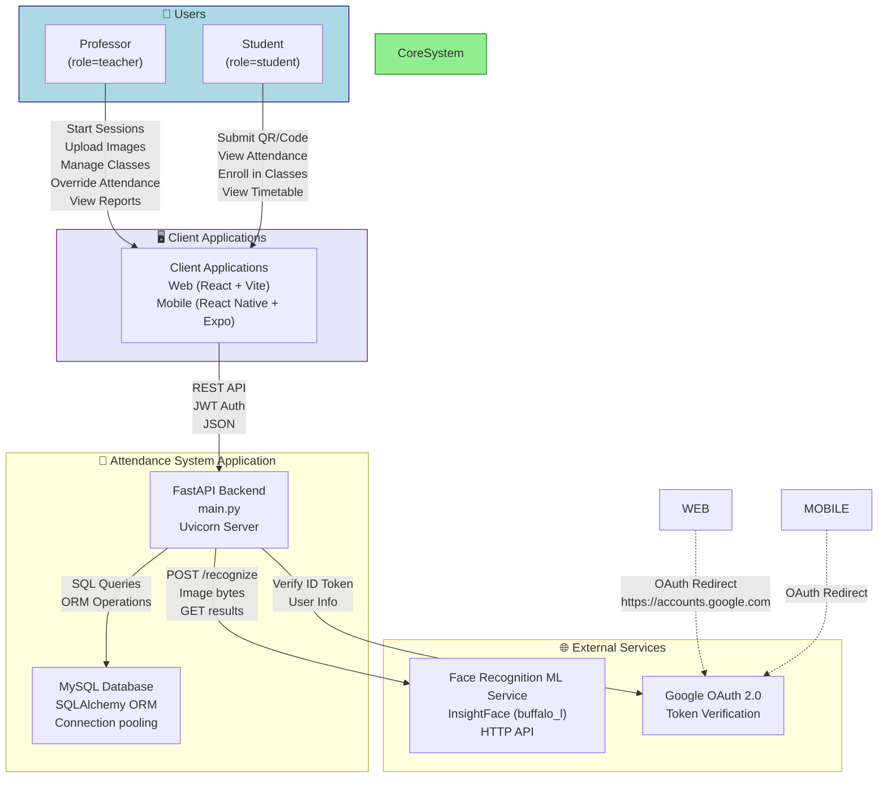

# System Context Diagram
## Automated College Attendance Management System

## Component Interactions

| User | Client | Action | Backend Route | Backend Service |
|------|--------|--------|---------------|-----------------|
| Faculty | Web | Start Session | POST /teachers/attendance/session/start | AttendanceLogic |
| Faculty | Web | Upload Image | POST /attendance/session/{id}/upload-image | FaceRecognitionService |
| Faculty | Web | Override Attendance | PATCH /teachers/attendance/session/{id}/override | AttendanceLogic |
| Faculty | Web | Finalize Session | POST /teachers/attendance/session/{id}/finalize | AttendanceLogic |
| Student | Web | Submit QR Code | POST /attendance/session/{id}/verify | AttendanceLogic |
| Student | Web | Submit Code | POST /attendance/submit-code | AttendanceLogic |
| Student | Web | Enroll | POST /students/enroll | StudentService |
| Student | Web | View Attendance | GET /students/attendance | StudentService |
| Any User | Any | Register | POST /auth/register | AuthService |
| Any User | Any | Login | POST /auth/login | AuthService |
| Any User | Any | Google OAuth | POST /auth/google | AuthService |
