# Backend Component Diagram
## Detailed Architecture of FastAPI Backend

```mermaid
graph TB
    subgraph Request["📨 Request Entry"]
        CORS["CORS Middleware<br/>allow_origins config"]
        LOG["Request Logger<br/>log incoming/outgoing"]
        LIFESPAN["Lifespan Manager<br/>startup/shutdown"]
    end
    
    subgraph APIRouters["🔌 API Router Layer (6 Routers)"]
        AuthR["Auth Router<br/>prefix: /auth<br/>• POST /register<br/>• POST /login<br/>• POST /google<br/>• GET /me"]
        TeacherR["Teacher Router<br/>prefix: /teachers<br/>• POST /subjects<br/>• GET /subjects<br/>• POST /classes<br/>• GET /classes<br/>• POST /attendance/session/start<br/>• GET /attendance/session/{id}<br/>• GET /attendance/session/{id}/records<br/>• PATCH /attendance/session/{id}/override<br/>• POST /attendance/session/{id}/finalize"]
        StudentR["Student Router<br/>prefix: /students<br/>• POST /enroll<br/>• GET /enrollments<br/>• DELETE /enroll/{class_id}<br/>• GET /attendance"]
        AttendanceR["Attendance Router<br/>prefix: /attendance<br/>• POST /session/create-with-code<br/>• POST /submit-code<br/>• POST /submit-qr-code<br/>• POST /upload-qr-image<br/>• POST /session/{id}/upload-image<br/>• POST /session/{id}/verify<br/>• GET /record/{record_id}<br/>• GET /session/{id}/records<br/>• GET /my-attendance"]
        EnrollmentsR["Enrollments Router<br/>prefix: /enrollments<br/>• GET /codes<br/>• POST /codes<br/>• DELETE /codes/{code_id}"]
        TimetableR["Timetable Router<br/>prefix: /timetable<br/>• POST /add<br/>• PUT /{timetable_id}<br/>• DELETE /{timetable_id}<br/>• GET /class/{class_id}<br/>• GET /student/my-timetable"]
    end
    
    subgraph Auth["🔐 Authentication & Security"]
        JWT["JWT Validator<br/>verify_token()<br/>TokenData extraction"]
        RBAC["Role Guards<br/>get_current_user()<br/>get_current_teacher()<br/>get_current_student()"]
        DEPS["FastAPI Dependencies<br/>Depends(get_db)<br/>Depends(get_current_user)"]
    end
    
    subgraph Services["🧠 Service Layer"]
        AuthServ["AuthService<br/>authenticate_local()<br/>authenticate_google()<br/>generate_jwt()<br/>register_user()"]
        AttendServ["AttendanceLogic Service<br/>compute_attendance_status()<br/>update_attendance_record()<br/>override_attendance()<br/>finalize_session()<br/>get_attendance_percentage()"]
        FaceServ["FaceRecognitionService<br/>recognize_faces()<br/>recognize_faces_with_image()<br/>get_student_id_from_name()"]
        AuditServ["AuditService<br/>log_audit()<br/>event tracking"]
        StorageServ["StorageService<br/>File upload handling"]
    end
    
    subgraph Models["📊 SQLAlchemy ORM Models"]
        UserM["User<br/>id, name, email<br/>roll_number, password_hash<br/>role, google_id<br/>provider, timestamps"]
        SubjectM["Subject<br/>id, name, code"]
        ClassM["Class<br/>id, subject_id, teacher_id<br/>year, section, timestamps"]
        EnrollM["StudentEnrollment<br/>id, student_id, class_id<br/>enrolled_at"]
        SessionM["AttendanceSession<br/>id, class_id, date<br/>qr_enabled, qr_code, qr_expires_at<br/>attendance_code, code_expires_at<br/>face_recognition_enabled, status"]
        RecordM["AttendanceRecord<br/>id, session_id, student_id<br/>face_detected, qr_verified<br/>confidence, final_status<br/>overridden_by_teacher<br/>override_reason"]
        AuditM["AuditLog<br/>id, event_id, event_type<br/>entity_type, entity_id, user_id<br/>event_metadata, timestamp"]
        CodeM["EnrollmentCode<br/>id, class_id, code<br/>created_by, is_active"]
        ScheduleM["ClassSchedule<br/>id, class_id, day_of_week<br/>start_time, end_time, room_number"]
        TimetableM["Timetable<br/>id, class_id, day_of_week<br/>start_time, end_time, room_number"]
        ColorM["SubjectColor<br/>id, subject_id, color_code<br/>text_color"]
    end
    
    subgraph DB["💾 Database Layer"]
        MySQL["MySQL Database<br/>connection pooling<br/>connection recycling<br/>session management"]
    end
    
    subgraph External["🌐 External Services"]
        MLAPI["Face ML Service HTTP API<br/>POST /recognize<br/>Returns: recognized_faces[]<br/>with name, confidence, bbox"]
        OAUTH2["Google OAuth<br/>ID Token Verification"]
    end
    
    CORS --> LOG
    LOG --> LIFESPAN
    LIFESPAN --> JWT
    
    AuthR --> JWT
    TeacherR --> JWT
    StudentR --> JWT
    AttendanceR --> JWT
    EnrollmentsR --> JWT
    TimetableR --> JWT
    
    JWT --> RBAC
    RBAC --> DEPS
    
    AuthR --> AuthServ
    TeacherR --> AttendServ
    StudentR --> AttendServ
    AttendanceR --> AttendServ
    AttendanceR --> FaceServ
    AttendanceR --> AuditServ
    TeacherR --> AuditServ
    StudentR --> AuditServ
    AttendanceR --> StorageServ
    
    AuthServ --> OAUTH2
    AuthServ --> UserM
    
    AttendServ --> RecordM
    AttendServ --> SessionM
    AttendServ --> AuditM
    
    FaceServ --> MLAPI
    FaceServ --> RecordM
    
    AuditServ --> AuditM
    
    UserM --> MySQL
    SubjectM --> MySQL
    ClassM --> MySQL
    EnrollM --> MySQL
    SessionM --> MySQL
    RecordM --> MySQL
    AuditM --> MySQL
    CodeM --> MySQL
    ScheduleM --> MySQL
    TimetableM --> MySQL
    ColorM --> MySQL
    
    style Request fill:#fff3e0,stroke:#e65100
    style APIRouters fill:#bbdefb,stroke:#0d47a1
    style Auth fill:#c8e6c9,stroke:#1b5e20
    style Services fill:#ffe0b2,stroke:#e65100
    style Models fill:#f0f4c3,stroke:#9c7c00
    style DB fill:#d1c4e9,stroke:#512da8
    style External fill:#ffccbc,stroke:#bf360c
```

## Request Flow Example

1. **Request arrives** → CORS Middleware → Logger → Request body
2. **Authentication** → JWT Validator → Role Guard → Dependency Injection
3. **Router handler** → Service layer (business logic)
4. **Service calls** → ORM Models → Database queries
5. **Response** → JSON → Client

## Service Responsibilities

| Service | Responsibility | Key Methods |
|---------|-----------------|------------|
| AuthService | User auth, JWT generation, Google OAuth | authenticate_local(), authenticate_google(), generate_jwt() |
| AttendanceLogic | Status computation, overrides, finalization | compute_attendance_status(), override_attendance(), finalize_session() |
| FaceRecognitionService | ML service integration | recognize_faces(), get_student_id_from_name() |
| AuditService | Event logging | log_audit() |
| StorageService | File upload/download | upload_image(), get_file() |

## Database Connections

- **Pool size:** 10 connections
- **Max overflow:** 20
- **Pool recycle:** 3600 seconds (prevents MySQL timeout)
- **Echo:** false (disable SQL logging in production)
