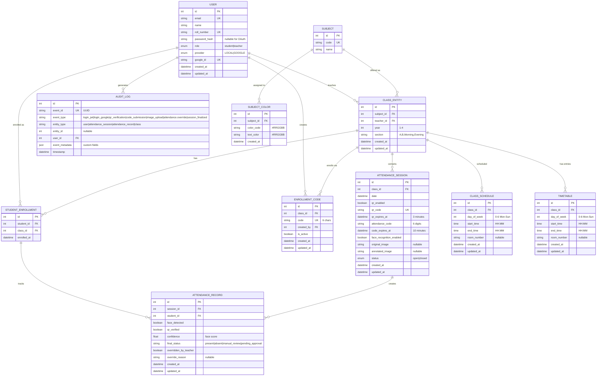

# Entity-Relationship Diagram (ERD)
## Complete Database Schema with Relationships



## Attendance Decision Logic (in ATTENDANCE_RECORD.final_status)

```
if face_detected AND qr_verified:
    final_status = "present"
elif face_detected OR qr_verified:
    final_status = "manual_review" (or "pending_approval")
else:
    final_status = "absent"
    
If overridden_by_teacher = true:
    final_status = teacher's chosen value (highest priority)
```

## Key Relationships Summary

| Table | Related Table | Type | Foreign Key | Cascade |
|-------|---------------|------|-------------|---------|
| CLASS | USER | N:1 | teacher_id | NO |
| CLASS | SUBJECT | N:1 | subject_id | NO |
| STUDENT_ENROLLMENT | USER | N:1 | student_id | YES |
| STUDENT_ENROLLMENT | CLASS | N:1 | class_id | YES |
| ATTENDANCE_SESSION | CLASS | N:1 | class_id | YES |
| ATTENDANCE_RECORD | ATTENDANCE_SESSION | N:1 | session_id | YES |
| ATTENDANCE_RECORD | USER | N:1 | student_id | NO |
| AUDIT_LOG | USER | N:1 | user_id | NO |
| ENROLLMENT_CODE | CLASS | N:1 | class_id | YES |
| ENROLLMENT_CODE | USER | N:1 | created_by | NO |
| CLASS_SCHEDULE | CLASS | N:1 | class_id | YES |
| TIMETABLE | CLASS | N:1 | class_id | YES |
| SUBJECT_COLOR | SUBJECT | 1:1 | subject_id | YES |

## Indexes for Performance

- USER.email (unique)
- USER.roll_number (unique)
- USER.google_id (unique)
- SUBJECT.code (unique)
- ATTENDANCE_SESSION.qr_code (unique)
- ENROLLMENT_CODE.code (unique)
- CLASS.subject_id, teacher_id, year, section (composite)
- STUDENT_ENROLLMENT.student_id, class_id (composite unique)
- ATTENDANCE_RECORD.session_id, student_id (composite unique)
- ATTENDANCE_SESSION.class_id, date
- AUDIT_LOG.event_type, user_id, entity_type
