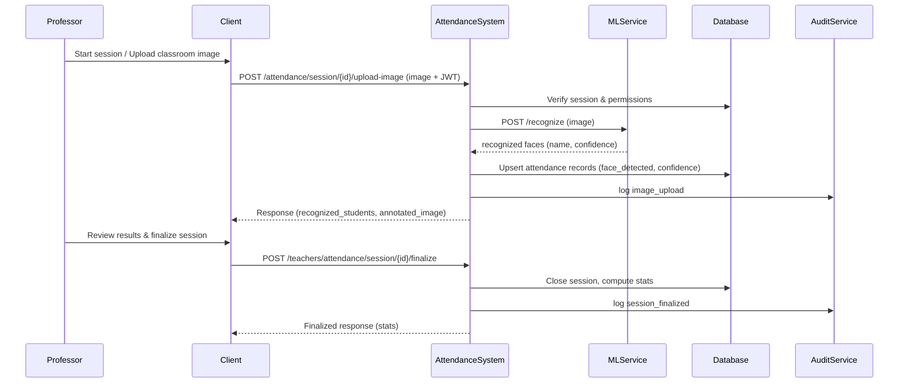

# Sequence Diagram: Face Recognition Mode
## Detailed Flow with Exact API Endpoints & Database Operations

## High-Level Notes

- The teacher starts a session, uploads a classroom image, and reviews the recognition results.
- The backend sends the image to the external face recognition service and stores the returned attendance decisions.
- The session is finalized after review and the final statistics are saved.
