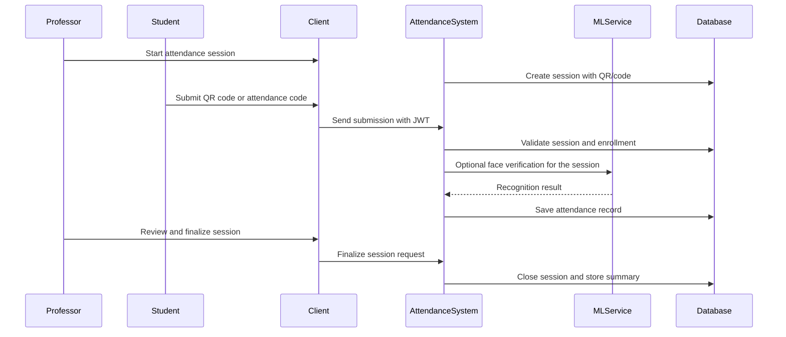

# Sequence Diagram: QR / Code Submission Mode
## Student Attendance Submission Flow

## High-Level Notes

- The teacher creates an attendance session with QR/code options enabled.
- Students submit either the QR code or the attendance code through the client.
- The backend validates the submission, stores the attendance result, and the teacher finalizes the session afterward.
