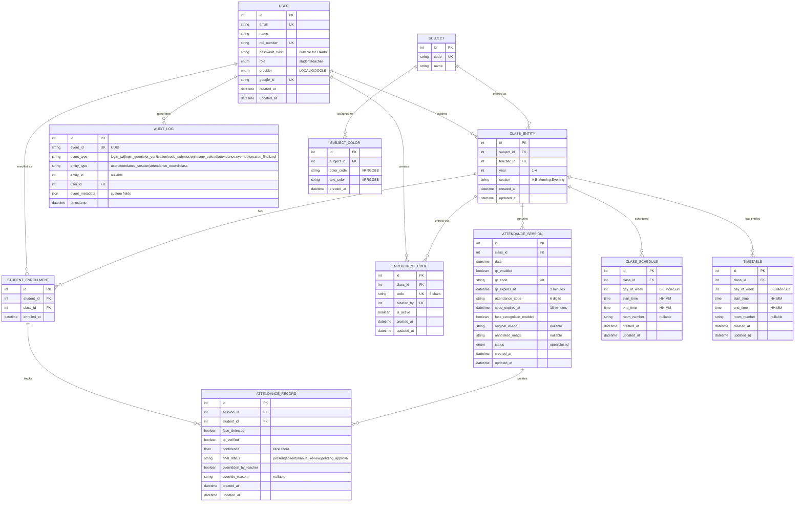

# Database Design

## Database Design

### Database Schema

The application uses a relational schema designed around academic administration and attendance tracking.

| Table | Purpose | Important Fields |
|---|---|---|
| `users` | Stores students and teachers in one table. | `id`, `name`, `email`, `roll_number`, `password_hash`, `role`, `provider`, `google_id`, `created_at`, `updated_at` |
| `subjects` | Stores courses or subject definitions. | `id`, `name`, `code` |
| `classes` | Stores subject sections taught by a teacher. | `id`, `subject_id`, `teacher_id`, `year`, `section` |
| `student_enrollments` | Join table linking students to classes. | `id`, `student_id`, `class_id`, `enrolled_at` |
| `attendance_sessions` | Represents one attendance event for a class. | `id`, `class_id`, `date`, `qr_enabled`, `qr_code`, `attendance_code`, `qr_expires_at`, `code_expires_at`, `face_recognition_enabled`, `status` |
| `attendance_records` | Stores raw attendance signals and final decision. | `id`, `session_id`, `student_id`, `face_detected`, `qr_verified`, `confidence`, `final_status`, `overridden_by_teacher`, `override_reason` |
| `enrollment_codes` | Stores codes used by students to join a class. | `id`, `class_id`, `code`, `created_by`, `is_active` |
| `class_schedules` | Stores weekly timetable-style schedules for a class. | `id`, `class_id`, `day_of_week`, `start_time`, `end_time`, `room_number` |
| `timetables` | Stores timetable entries used by student and professor views. | `id`, `class_id`, `day_of_week`, `start_time`, `end_time`, `room_number` |
| `subject_colors` | Assigns consistent visual colors to subjects. | `id`, `subject_id`, `color_code`, `text_color` |
| `audit_logs` | Captures important system actions for traceability. | `id`, `event_id`, `event_type`, `entity_type`, `entity_id`, `user_id`, `event_metadata`, `timestamp` |

### Relationships

- Teacher to class: 1 to many.
- Subject to class: 1 to many.
- Student to class: many to many through `student_enrollments`.
- Class to attendance session: 1 to many.
- Attendance session to attendance record: 1 to many.
- Class to schedule: 1 to many.
- Class to timetable entry: 1 to many.
- Subject to color mapping: 1 to 1.
- User to enrollment code: 1 to many.
- User to audit log entry: 1 to many.

## Entity-Relationship Diagram (ERD)

