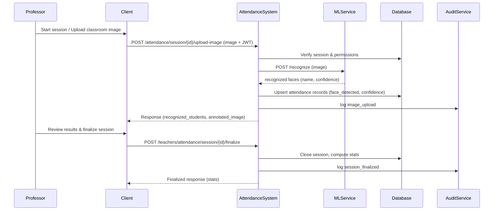
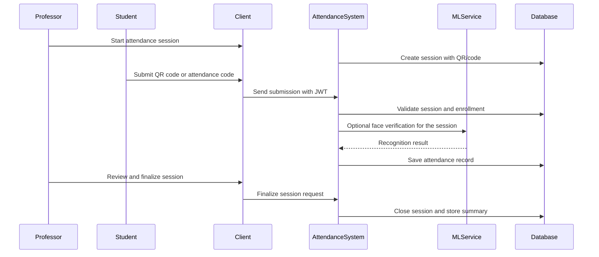

# ML Module: Face Recognition

## Overview

The ML portion of the project uses **[InsightFace](https://github.com/deepinsight/insightface)** for face recognition and verification.

**Model Variant:** buffalo_l, a large-scale face detection and recognition model trained using [ArcFace: Additive Angular Margin Loss for Deep Face Recognition](https://arxiv.org/abs/1801.07698).

**Inference:** The model runs via [ONNX Runtime](https://onnxruntime.ai/) for cross-platform compatibility.

The repository contains an operational inference layer in `face-api` and a model development pipeline in `FaceModel`.

## Training Process

The `FaceModel` folder contains scripts for:

- Generating face embeddings
- Training a classifier
- Evaluating recognition results
- Recognizing faces from uploaded images

## Dataset

The repository includes dataset and embedding directories:

- `dataset/` — Raw training images
- `embeddings/` — Generated face embeddings
- `embeddings1/` — Alternative embedding set
- `ICFD_Samples/` — Sample images for testing
- `recognized_outputs/` — Face recognition results

## Inference Pipeline

1. The teacher uploads an attendance image.
2. The backend forwards the image to the recognition service.
3. The recognition layer extracts faces and confidence values.
4. The backend matches identities against enrolled students.
5. Attendance records are updated with face-detection results.
6. Annotated images are optionally returned for review.

## Deployment Notes

For deployment guidance, refer to the [Setup Guide](../setup/index.md). The AI service can run as:

- A separate container on a hosting platform (Render, Docker host, VM)
- A local service with ngrok tunneling for development and testing
- An isolated microservice behind authenticated API endpoints

## Dual Verification (Face + QR/Code) — Flow Summary

This project supports an optional "dual verification" mode where both face-recognition and a code/QR must be verified before marking a student present. The backend enforces the following simplified flow:

- Session created with `face_recognition_enabled` and `attendance_code`/`qr_enabled` → session requires dual verification.
- On session start the system pre-creates attendance records with `status = manual_review`.
- Professor uploads image → face recognition runs and sets `face_detected = true` for matched records.
	- If the session requires dual verification, the record transitions to `pending_approval` (or similar), not `present`.
- Student submits the attendance code or scans the QR → backend sets `qr_verified = true` for that record.
	- When both `face_detected` and `qr_verified` are true and the session requires dual verification, the backend computes and sets `status = present`.

Edge cases:
- If the student never submits the code before session expiry, the record stays `pending_approval` and awaits teacher review (`manual_review`).
- If dual verification is not enabled, a single successful signal (face OR code/QR as configured) may be enough to mark `present` depending on session settings.

See the repository file `DUAL_VERIFICATION_TEST_GUIDE.md` for test patterns and expected log lines.

## Sequence Diagram: 

### Face Recognition Mode (Face Recognition + QR/Numeric-Code)

### Attendance Flow (Only QR / Code Submission)

