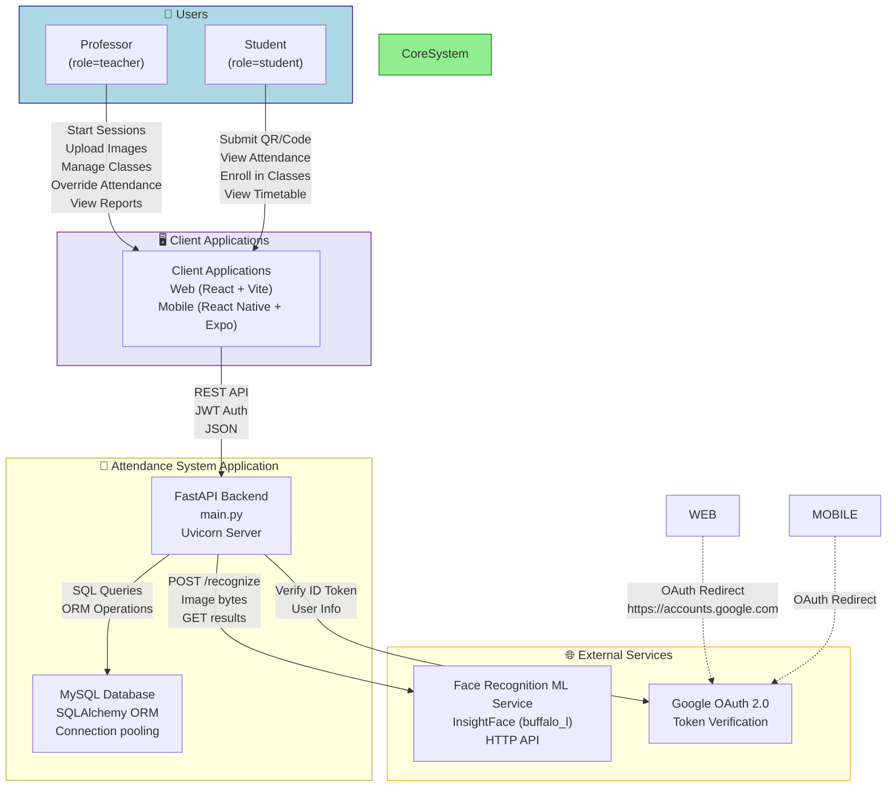
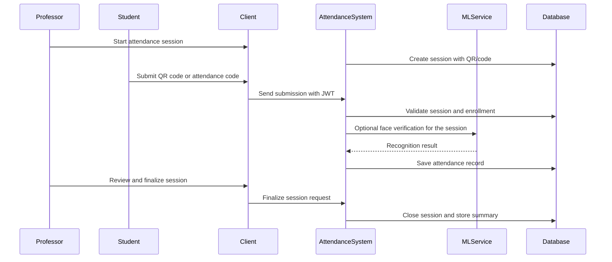

# Project Overview and Architecture

## Project Overview

The Smart Attendance System is a college attendance platform built from four main parts:

- `backend/`: FastAPI API and business logic.
- `AppFrontend/`: Expo React Native mobile app.
- `frontend/`: Vite React web app.
- `FaceModel/`: face-recognition model training and experimentation pipeline.

Attendance can be captured through a numeric code, QR code, or face recognition. Face recognition is handled by a separate inference service (`face-api/`) backed by the model pipeline in `FaceModel/`. MySQL stores persistent data, while JWT handles authentication for local accounts and Google OAuth.

### Key Features

- Student and teacher authentication using email/password and Google OAuth.
- JWT-based session handling and role-based access control.
- Class, subject, and timetable management.
- Enrollment through codes and manual teacher enrollment.
- Attendance sessions with QR, code, and face-recognition support.
- Teacher approval and override of pending attendance records.
- Student attendance dashboards and per-subject statistics.
- Audit logging for important system actions.

## System Architecture

### High-Level View

The system follows a layered client-server architecture:

| Layer | Responsibility | Main Codebase |
|---|---|---|
| Client | Mobile and web user interfaces | `AppFrontend/`, `frontend/` |
| Application | API endpoints, authorization, and attendance workflows | `backend/` |
| Data | Persistent storage and ORM models | MySQL + SQLAlchemy |
| AI/ML | Face recognition training and inference | `FaceModel/`, `face-api/` |
| External services | Google OAuth and optional image storage | Google services, cloud storage |

### Client Applications

#### Mobile App: `AppFrontend/`

- Built with Expo, React Native, TypeScript, and Expo Router.
- Designed for mobile-first attendance flows.
- Supports login, attendance submission, camera-based actions, and student or teacher dashboards.
- Uses `expo.extra.apiUrl` to connect to the backend API.

#### Web App: `frontend/`

- Built with Vite, React, TypeScript, Tailwind CSS, and shadcn-style components.
- Designed for browser-based access and dashboard-style workflows.
- Uses SPA routing with Vercel rewrite support.

### Backend Architecture

The backend uses FastAPI with a modular router and service pattern:

- **Routers** define API endpoints for authentication, teacher operations, student operations, attendance, enrollments, and timetable management.
- **Services** contain business logic such as attendance state updates, face recognition integration, authorization helpers, audit logging, and storage helpers.
- **Utils** provide JWT helpers, role checks, Google token validation, and query helper functions.
- **Database session management** is handled through SQLAlchemy and a shared session dependency.

## Architecture Diagrams

### System Context Diagram

### Backend Component Diagram

```mermaid
graph TB
	subgraph Request["📨 Request Entry"]
		CORS["CORS Middleware<br/>allow_origins config"]
		LOG["Request Logger<br/>log incoming/outgoing"]
		LIFESPAN["Lifespan Manager<br/>startup/shutdown"]
	end
    
	subgraph APIRouters["🔌 API Router Layer (6 Routers)"]
		AuthR["Auth Router<br/>prefix: /auth<br/>• POST /register<br/>• POST /login<br/>• POST /google<br/>• GET /me"]
		TeacherR["Teacher Router<br/>prefix: /teachers<br/>• POST /subjects<br/>• GET /subjects<br/>• POST /classes<br/>• GET /classes<br/>• POST /attendance/session/start<br/>• GET /attendance/session/{id}<br/>• GET /attendance/session/{id}/records<br/>• PATCH /attendance/session/{id}/override<br/>• POST /attendance/session/{id}/finalize"]
		StudentR["Student Router<br/>prefix: /students<br/>• POST /enroll<br/>• GET /enrollments<br/>• DELETE /enroll/{class_id}<br/>• GET /attendance"]
		AttendanceR["Attendance Router<br/>prefix: /attendance<br/>• POST /session/create-with-code<br/>• POST /submit-code<br/>• POST /submit-qr-code<br/>• POST /upload-qr-image<br/>• POST /session/{id}/upload-image<br/>• POST /session/{id}/verify<br/>• GET /record/{record_id}<br/>• GET /session/{id}/records<br/>• GET /my-attendance"]
		EnrollmentsR["Enrollments Router<br/>prefix: /enrollments<br/>• GET /codes<br/>• POST /codes<br/>• DELETE /codes/{code_id}"]
		TimetableR["Timetable Router<br/>prefix: /timetable<br/>• POST /add<br/>• PUT /{timetable_id}<br/>• DELETE /{timetable_id}<br/>• GET /class/{class_id}<br/>• GET /student/my-timetable"]
	end
    
	subgraph Auth["🔐 Authentication & Security"]
		JWT["JWT Validator<br/>verify_token()<br/>TokenData extraction"]
		RBAC["Role Guards<br/>get_current_user()<br/>get_current_teacher()<br/>get_current_student()"]
		DEPS["FastAPI Dependencies<br/>Depends(get_db)<br/>Depends(get_current_user)"]
	end
    
	subgraph Services["🧠 Service Layer"]
		AuthServ["AuthService<br/>authenticate_local()<br/>authenticate_google()<br/>generate_jwt()<br/>register_user()"]
		AttendServ["AttendanceLogic Service<br/>compute_attendance_status()<br/>update_attendance_record()<br/>override_attendance()<br/>finalize_session()<br/>get_attendance_percentage()"]
		FaceServ["FaceRecognitionService<br/>recognize_faces()<br/>recognize_faces_with_image()<br/>get_student_id_from_name()"]
		AuditServ["AuditService<br/>log_audit()<br/>event tracking"]
		StorageServ["StorageService<br/>File upload handling"]
	end
    
	subgraph Models["📊 SQLAlchemy ORM Models"]
		UserM["User<br/>id, name, email<br/>roll_number, password_hash<br/>role, google_id<br/>provider, timestamps"]
		SubjectM["Subject<br/>id, name, code"]
		ClassM["Class<br/>id, subject_id, teacher_id<br/>year, section, timestamps"]
		EnrollM["StudentEnrollment<br/>id, student_id, class_id<br/>enrolled_at"]
		SessionM["AttendanceSession<br/>id, class_id, date<br/>qr_enabled, qr_code, qr_expires_at<br/>attendance_code, code_expires_at<br/>face_recognition_enabled, status"]
		RecordM["AttendanceRecord<br/>id, session_id, student_id<br/>face_detected, qr_verified<br/>confidence, final_status<br/>overridden_by_teacher<br/>override_reason"]
		AuditM["AuditLog<br/>id, event_id, event_type<br/>entity_type, entity_id, user_id<br/>event_metadata, timestamp"]
		CodeM["EnrollmentCode<br/>id, class_id, code<br/>created_by, is_active"]
		ScheduleM["ClassSchedule<br/>id, class_id, day_of_week<br/>start_time, end_time, room_number"]
		TimetableM["Timetable<br/>id, class_id, day_of_week<br/>start_time, end_time, room_number"]
		ColorM["SubjectColor<br/>id, subject_id, color_code<br/>text_color"]
	end
    
	subgraph DB["💾 Database Layer"]
		MySQL["MySQL Database<br/>connection pooling<br/>connection recycling<br/>session management"]
	end
    
	subgraph External["🌐 External Services"]
		MLAPI["Face ML Service HTTP API<br/>POST /recognize<br/>Returns: recognized_faces[]<br/>with name, confidence, bbox"]
		OAUTH2["Google OAuth<br/>ID Token Verification"]
	end
    
	CORS --> LOG
	LOG --> LIFESPAN
	LIFESPAN --> JWT
    
	AuthR --> JWT
	TeacherR --> JWT
	StudentR --> JWT
	AttendanceR --> JWT
	EnrollmentsR --> JWT
	TimetableR --> JWT
    
	JWT --> RBAC
	RBAC --> DEPS
    
	AuthR --> AuthServ
	TeacherR --> AttendServ
	StudentR --> AttendServ
	AttendanceR --> AttendServ
	AttendanceR --> FaceServ
	AttendanceR --> AuditServ
	TeacherR --> AuditServ
	StudentR --> AuditServ
	AttendanceR --> StorageServ
    
	AuthServ --> OAUTH2
	AuthServ --> UserM
    
	AttendServ --> RecordM
	AttendServ --> SessionM
	AttendServ --> AuditM
    
	FaceServ --> MLAPI
	FaceServ --> RecordM
    
	AuditServ --> AuditM
    
	UserM --> MySQL
	SubjectM --> MySQL
	ClassM --> MySQL
	EnrollM --> MySQL
	SessionM --> MySQL
	RecordM --> MySQL
	AuditM --> MySQL
	CodeM --> MySQL
	ScheduleM --> MySQL
	TimetableM --> MySQL
	ColorM --> MySQL
    
	style Request fill:#fff3e0,stroke:#e65100
	style APIRouters fill:#bbdefb,stroke:#0d47a1
	style Auth fill:#c8e6c9,stroke:#1b5e20
	style Services fill:#ffe0b2,stroke:#e65100
	style Models fill:#f0f4c3,stroke:#9c7c00
	style DB fill:#d1c4e9,stroke:#512da8
	style External fill:#ffccbc,stroke:#bf360c
```

### Attendance Flow (QR / Code Submission)

